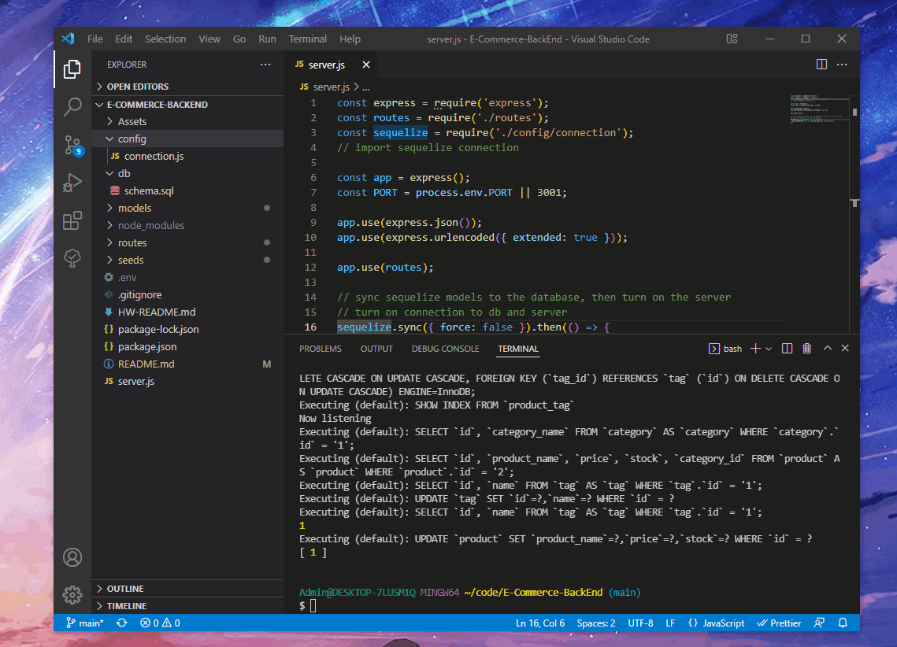

# E-Commerce-BackEnd
Building the back end for an e-commerce site by modifying starter code.

## Overview:
Fixed inncorect model name, and some other seeding issues, which got my code to work. Fixed the validation error I was having with the models, and set up insomnia.

## Screenshot:

### [GitHub](https://github.com/Acanthodoris/E-Commerce-BackEnd)

## Credits: